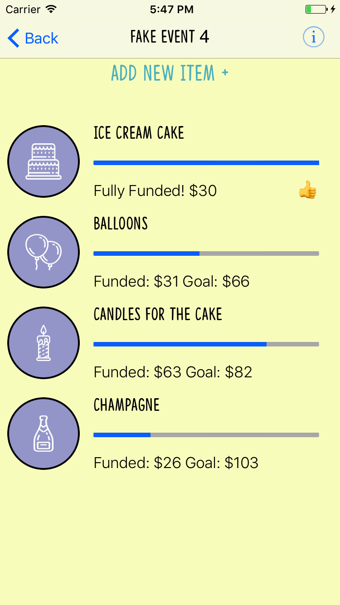
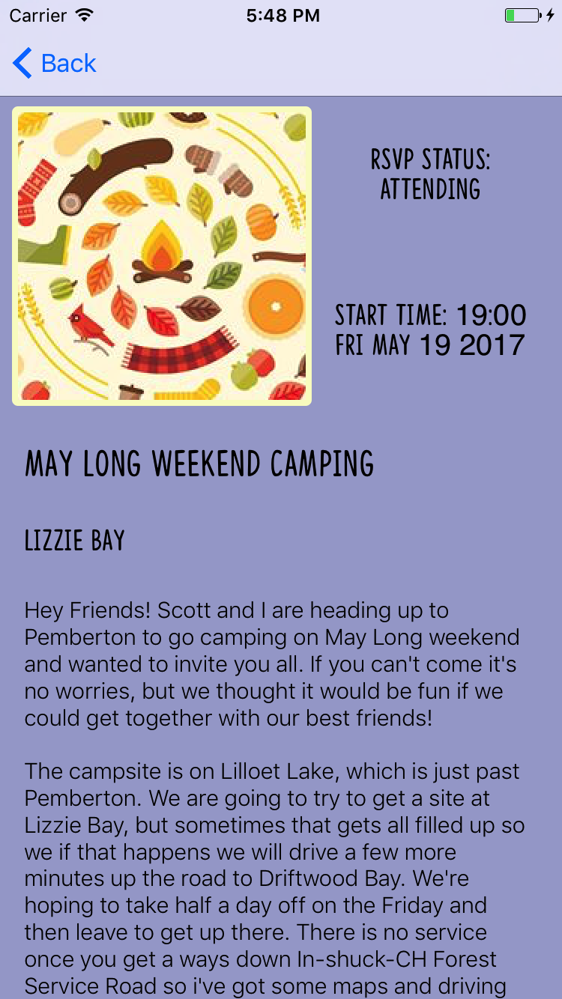
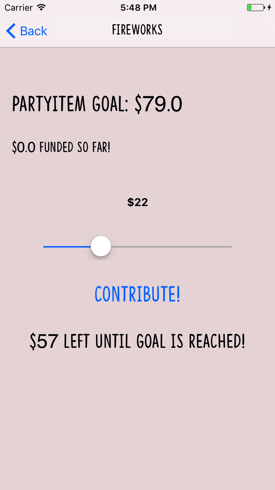

# Integrates with Facebook’s API to help organize more detailed event planning. 
The user can see the events that they are attending on Facebook and add items to be crowdfunded for the event such as food, beverages, party hats etc. 
In addition to this, users attending can also pledge money via in app Stripe payments and view the item's progress.

